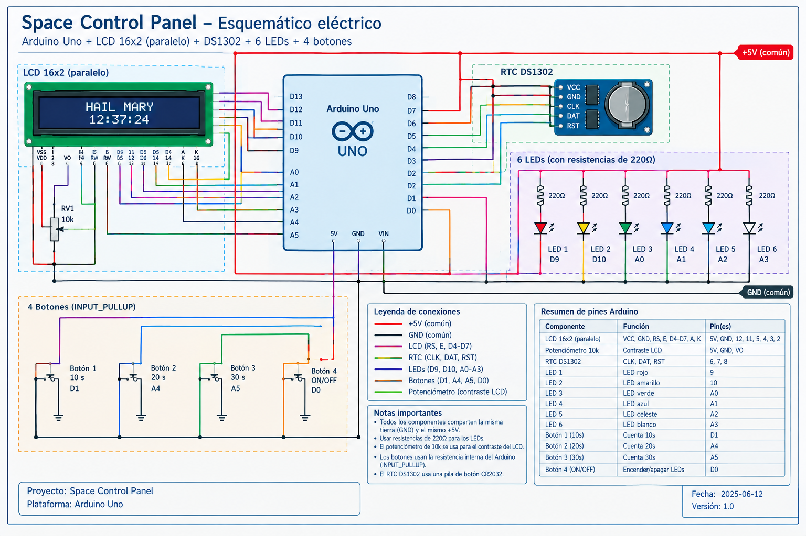
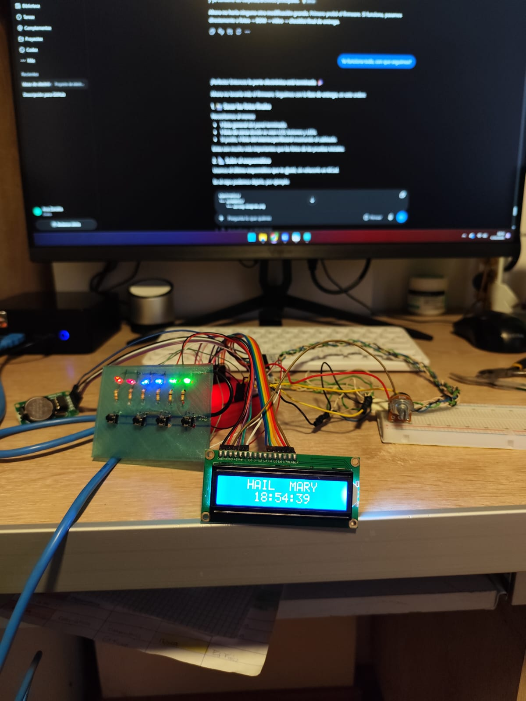
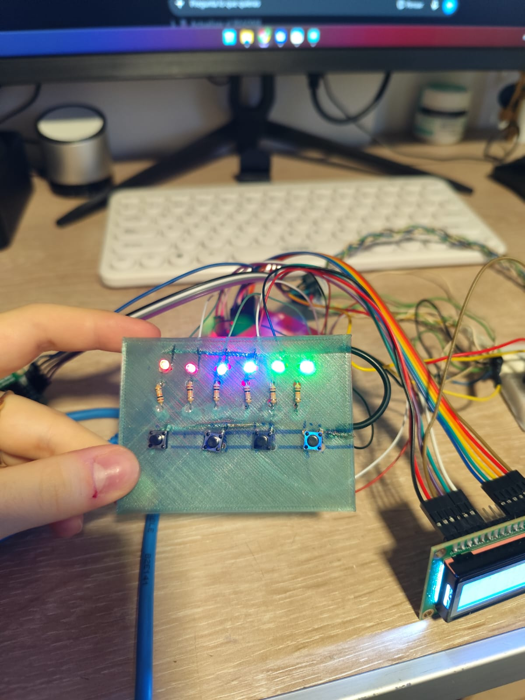
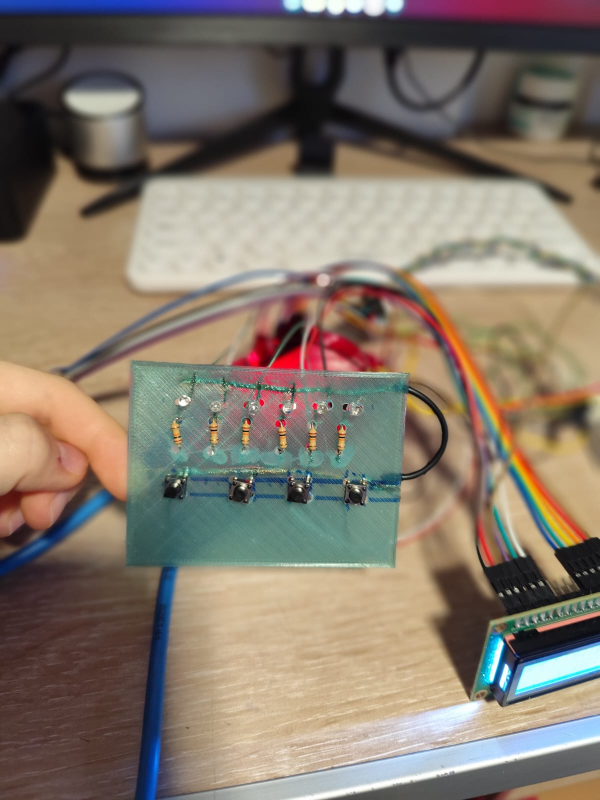

# 🚀 Decorative Rocket Console

A small Arduino-based sci-fi spaceship control panel inspired by spacecraft interfaces from science fiction.

The project combines a real-time clock, a 16x2 LCD, physical controls and six LED indicators to create a functional decorative spacecraft console.

## Features

* Arduino Uno control
* 16x2 parallel LCD
* DS1302 real-time clock
* 10k potentiometer for LCD contrast
* Three countdown buttons: 10, 20 and 30 seconds
* Six LED indicators
* Dedicated LED ON/OFF button
* Progressive LED countdown effect
* Permanent wiring on a perfboard
* Sci-fi inspired interface

## How It Works

The LCD continuously displays the current time provided by the DS1302 RTC.

The three countdown buttons start different sequences:

| Button   | Function            |
| -------- | ------------------- |
| Button 1 | 10-second countdown |
| Button 2 | 20-second countdown |
| Button 3 | 30-second countdown |
| Button 4 | Toggle LEDs ON/OFF  |

When a countdown starts, all six LEDs turn on. As the countdown progresses, the LEDs progressively turn off until the countdown reaches zero.

The clock continues running independently while a countdown is active.

The fourth button can be used to manually turn all six LEDs on or off when no countdown is running.

## Hardware

* Arduino Uno ×1
* 16x2 parallel LCD ×1
* DS1302 RTC module ×1
* 10k potentiometer ×1
* LEDs ×6
* 220Ω resistors ×6
* Push buttons ×4
* Perfboard ×1
* Hookup wire

## Pinout

### LCD

| LCD Pin  | Arduino Uno              |
| -------- | ------------------------ |
| RS       | D12                      |
| E        | D11                      |
| D4       | D5                       |
| D5       | D4                       |
| D6       | D3                       |
| D7       | D2                       |
| RW       | GND                      |
| VSS      | GND                      |
| VDD      | 5V                       |
| VO       | Potentiometer center pin |
| A / LED+ | 5V                       |
| K / LED− | GND                      |

The 10k potentiometer is connected between 5V and GND and its center pin controls the LCD contrast.

### DS1302 RTC

| RTC Pin  | Arduino Uno |
| -------- | ----------- |
| DAT / IO | D7          |
| CLK      | D6          |
| RST / CE | D8          |
| VCC      | 5V          |
| GND      | GND         |

### LEDs

| LED   | Arduino Uno |
| ----- | ----------- |
| LED 1 | D9          |
| LED 2 | D10         |
| LED 3 | A0          |
| LED 4 | A1          |
| LED 5 | A2          |
| LED 6 | A3          |

Each LED uses its own 220Ω current-limiting resistor.

### Buttons

| Button                | Arduino Uno |
| --------------------- | ----------- |
| Button 1 — 10 seconds | D1          |
| Button 2 — 20 seconds | A4          |
| Button 3 — 30 seconds | A5          |
| Button 4 — LED ON/OFF | D0          |

The buttons use the Arduino Uno's internal pull-up resistors. Each button connects its corresponding Arduino pin to GND when pressed.

> D0 and D1 are normally used for serial communication on the Arduino Uno. The final firmware does not use Serial communication, so these pins can be used for the control buttons.

## Wiring Diagram

The complete wiring diagram is included in the repository.



The diagram shows the Arduino Uno, LCD, DS1302 RTC, six LEDs with their 220Ω resistors, four buttons, potentiometer, 5V connections and common ground.

## Project Photos

### Final Build



The completed Decorative Rocket Console with the LCD, LED indicators and physical controls installed.

### Final Build Detail



Close-up view of the finished control panel.

### Electronics



View of the electronics and permanent perfboard assembly.

## Demo

The final demonstration shows the clock, countdown system, LED effects and physical controls working together.

[](YOUR_VIDEO_LINK_HERE)

## Firmware

The final Arduino firmware is located at:

`src/main.ino`

The firmware is written for the Arduino Uno using the Arduino framework.

### Libraries

The project uses:

* `LiquidCrystal`
* `ThreeWire`
* `RtcDS1302`

The firmware does not require Serial Monitor communication.

## Countdown System

The countdown system uses `millis()` rather than blocking the main program with long delays.

This allows the LCD clock to continue updating while the LED countdown is running.

The six LEDs progressively turn off according to the selected countdown duration:

* 10 seconds
* 20 seconds
* 30 seconds

When the countdown finishes, all LEDs are turned off automatically.

## Project Status

**Completed and tested.**

The final hardware has been assembled on a perfboard and the complete system has been tested.

The Arduino Uno, LCD, DS1302 RTC, six LEDs and four physical buttons are integrated and working with the final firmware.

The completed project is documented with a wiring diagram, final photos, firmware and a demonstration video.

## Why I Made This

I wanted to create something more interesting than a typical beginner Arduino project.

The idea was to build a small physical control panel that feels like part of a spacecraft while still being a functional electronics project.

I was inspired by science-fiction spacecraft interfaces and wanted to combine electronics, programming and physical controls into one compact device.

The project also gave me the opportunity to design the behavior of the interface myself, test the electronics in stages and then move the final circuit from a breadboard prototype to a permanent perfboard assembly.

## Project Structure

```text
Decorative-Rocket-Console/
│
├── images/
│   ├── 1.jpeg
│   ├── 2.jpeg
│   ├── final-1.jpeg
│   ├── final-2.jpeg
│   └── final-3.jpeg
│
├── electronics/
│   └── schematic/
│       └── wiring-diagram.png
│
├── src/
│   └── main.ino
│
├── README.md
├── JOURNAL.md
└── BOM.md
```

## License

This project is shared for educational and personal use.
