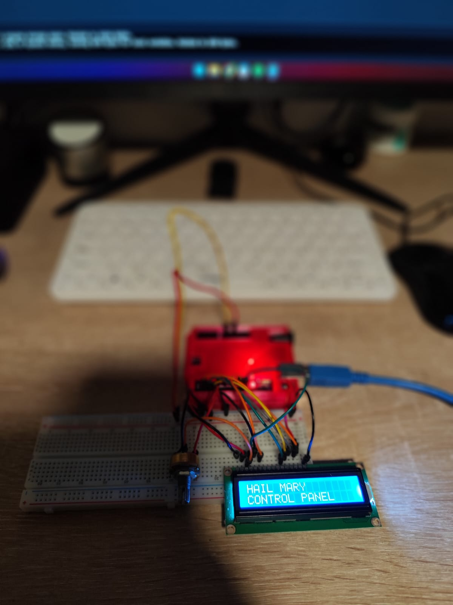
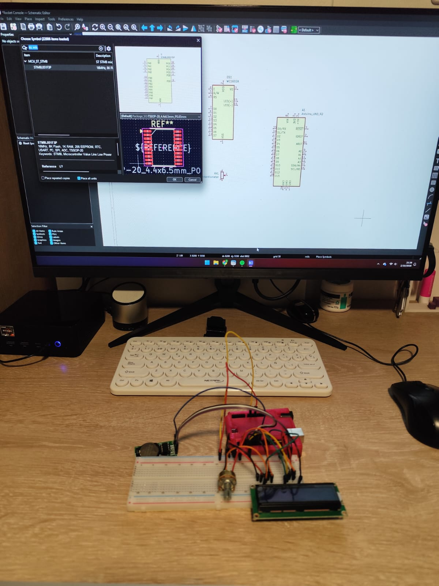

# Spaceship Control Panel 🚀

A small Arduino-based spaceship control panel inspired by sci-fi interfaces.

The project is being built around an Arduino Uno and combines a real-time clock with a 16x2 LCD and visual controls.

## Current Features

* 16x2 LCD display
* DS1302 real-time clock
* LCD contrast adjustment using a 10k potentiometer
* Current time displayed continuously on the LCD

## Planned Features

* 3 push buttons
* 6 LEDs
* 10, 20 and 30 second countdown sequences
* LED fade and animation effects
* Optional buzzer feedback
* Sci-fi inspired control panel design

## Hardware

* Arduino Uno
* 16x2 LCD
* DS1302 RTC module
* 10k potentiometer
* 3 push buttons
* 6 LEDs
* Resistors
* Breadboard and jumper wires

## Project Status

**In progress**

The LCD and DS1302 RTC are currently working. The remaining controls and LED effects will be added as development continues.

## Progress Photos

### LCD Test

The LCD was tested successfully and displayed the control panel message.

### RTC Test

The DS1302 real-time clock was connected to the Arduino and successfully displayed the current time on the LCD.

## Journal

Development notes and progress are documented in [`JOURNAL.md`](JOURNAL.md).
